# Lo-Fi Music Generator
### 204466 Deep Learning — Final Project Report

---

| | |
|---|---|
| **Name** | **Student ID** |
| Alexander Gildenberg | 6814050781 |
| Leander Hofherr | 6810045121 |
| Adrien Lass | 6814050790 |

| | |
|---|---|
| **Course** | 204466 Deep Learning |
| **Due Date** | May 11, before midnight |
| **Framework** | PyTorch |
| **Repository** | https://github.com/homerman5098/deep_learning_final_project.git |

---

## Table of Contents

1. [Final Project Topic](#1-final-project-topic)
2. [Why Is This Topic Interesting?](#2-why-is-this-topic-interesting)
3. [Why Deep Learning?](#3-why-deep-learning)
4. [Deep Learning Architecture](#4-deep-learning-architecture)
5. [Code Explanation](#5-code-explanation)
6. [GitHub Repository](#6-github-repository)
7. [Training Method, Dataset, and Evaluation](#7-training-method-dataset-and-evaluation)
8. [Reference Articles and Related Work](#8-reference-articles-and-related-work)
9. [Group Member Contributions](#9-group-member-contributions)

---

## 1. Final Project Topic

This project implements a **Lo-Fi Hip-Hop Music Generator** using a Long Short-Term Memory (LSTM) recurrent neural network trained on jazz chord progressions. The model learns the harmonic structure of lo-fi music and generates new chord sequences, which are then synthesised into a full multi-track audio file — complete with drums, bass, chords, and melody — and exported as an MP3.

Lo-fi (low fidelity) hip-hop is a music genre characterised by slow tempos (75–90 BPM), jazz-influenced chord voicings (major 7th, minor 7th, dominant 9th), boom-bap drum patterns, and a deliberately relaxed, nostalgic atmosphere.

---

## 2. Why Is This Topic Interesting?

Lo-fi music has experienced a massive cultural resurgence in the 2020s, largely driven by YouTube "study music" streams that have accumulated billions of views. This intersection of music and artificial intelligence is compelling for several reasons:

1. **Creative AI** — Generating music pushes the boundary of what neural networks can create. Unlike classification or regression, generation requires the model to produce novel, coherent, and aesthetically pleasing output.

2. **Practical application** — AI-generated background music has real commercial value for content creators, app developers, and educators who need royalty-free music at scale.

3. **Interdisciplinary challenge** — The problem sits at the intersection of music theory, signal processing, and machine learning, requiring a nuanced understanding of each domain.

4. **Accessibility** — Lo-fi's structural simplicity (repetitive chord loops, consistent rhythm) makes it an achievable target for a generative model without requiring massive datasets or compute, while still producing recognisably musical output.

---

## 3. Why Deep Learning?

### Comparison with Alternative Approaches

Music generation is a sequential prediction problem — each note or chord depends on what came before. The table below compares deep learning against traditional approaches.

| Approach | How It Works | Strengths | Weaknesses |
|---|---|---|---|
| Rule-based / Algorithmic | Hand-coded music theory rules | Predictable, always valid output | Rigid; cannot generalise; no "feel" |
| Markov Chains | Transition probabilities between chords | Simple; interpretable; fast | No long-range memory; loses structure over time |
| Genetic Algorithms | Evolutionary optimisation of sequences | Can explore diverse outputs | Slow; requires a fitness function |
| Variational Autoencoder (VAE) | Learns a latent space of musical phrases | Good for style interpolation | Less suited to sequential generation |
| **LSTM (our approach)** | Learns sequential dependencies via gating | Long-range memory; learns style implicitly; end-to-end | Needs training data; can be unstable |

### Why LSTM Specifically?

A standard feedforward neural network cannot handle sequential data because it has no memory of previous inputs. A vanilla RNN has memory but suffers from vanishing gradients over long sequences. The **LSTM** solves this with three learnable gates:

- **Forget gate** — decides what to erase from memory
- **Input gate** — decides what new information to store
- **Output gate** — decides what to pass to the next timestep

This architecture is essential for music because a chord in bar 8 can depend on the key established in bar 1 — a dependency span far beyond the reach of Markov chains.

### Strengths and Weaknesses of Our Approach

**Strengths:**
- Learns authentic harmonic patterns from data without hand-crafted rules
- Generalises to new progressions not seen during training
- Temperature sampling allows control over creativity vs. coherence

**Weaknesses:**
- Requires a meaningful training corpus; small datasets lead to repetitive output
- Does not model rhythm or dynamics directly — these are handled by rule-based synthesis
- The quality of the final audio depends on the synthesiser used

---

## 4. Deep Learning Architecture

### Architecture Overview

Our model is a **two-layer LSTM** operating at the chord level. The vocabulary consists of 11 lo-fi jazz chord types. The model predicts the next chord given all previous chords in a sequence.

The data flows left to right through five stages. Each LSTM layer maintains a recurrent hidden state `(h, c)` passed forward at every timestep, allowing the model to remember harmonic context across many bars:

| Stage | 1 | 2 | 3 | 4 | 5 | 6 |
|---|---|---|---|---|---|---|
| **Layer** | Input | Embedding | LSTM 1 | Dropout | LSTM 2 | Linear |
| **Shape** | (batch, seq) | (batch, seq, 128) | (batch, seq, 128) | (batch, seq, 128) | (batch, seq, 128) | (batch, seq, 11) |

### Layer-by-Layer Summary

| Layer | Type | Input Shape | Output Shape |
|---|---|---|---|
| Embedding | `nn.Embedding` | (batch, seq) | (batch, seq, 128) |
| LSTM Layer 1 | `nn.LSTM` | (batch, seq, 128) | (batch, seq, 128) |
| Dropout | `nn.Dropout` | (batch, seq, 128) | (batch, seq, 128) |
| LSTM Layer 2 | `nn.LSTM` | (batch, seq, 128) | (batch, seq, 128) |
| Linear | `nn.Linear` | (batch, seq, 128) | (batch, seq, 11) |

### LSTM Gate Equations

Each LSTM cell computes the following at every timestep *t*:

$$f_t = \sigma(W_f \cdot [h_{t-1}, x_t] + b_f) \quad \text{(forget gate)}$$

$$i_t = \sigma(W_i \cdot [h_{t-1}, x_t] + b_i) \quad \text{(input gate)}$$

$$\tilde{C}_t = \tanh(W_C \cdot [h_{t-1}, x_t] + b_C) \quad \text{(candidate cell state)}$$

$$C_t = f_t \odot C_{t-1} + i_t \odot \tilde{C}_t \quad \text{(cell state update)}$$

$$o_t = \sigma(W_o \cdot [h_{t-1}, x_t] + b_o) \quad \text{(output gate)}$$

$$h_t = o_t \odot \tanh(C_t) \quad \text{(hidden state output)}$$

where σ is the sigmoid function and ⊙ is element-wise multiplication.

### Architecture Diagram



## 5. Code Explanation

The entire project is implemented in a single file: `lofi_generator.py`, divided into 11 clearly labelled sections.

### Section 0 — Configuration

All hyperparameters are defined at the top of the file for easy tuning:

```python
BPM           = 80      # Lo-fi tempo (slow & laid-back)
HIDDEN_SIZE   = 128     # Number of LSTM hidden units per layer
NUM_LAYERS    = 2       # Number of stacked LSTM layers
SEQ_LENGTH    = 16      # Training sequence length in chords
BATCH_SIZE    = 32
NUM_EPOCHS    = 60      # ~10 min on a GPU
LR            = 0.003   # Adam learning rate
TEMPERATURE   = 0.8     # Generation temperature (< 1 = conservative)
```

### Section 1 — Music Theory Vocabulary

The chord vocabulary is hand-crafted from lo-fi music theory. Each chord is a list of MIDI note numbers forming a jazz voicing:

```python
LOFI_CHORDS = {
    "Cmaj7":  [48, 52, 55, 59],   # C  E  G  B
    "Am7":    [45, 48, 52, 55],   # A  C  E  G
    "Dm7":    [50, 53, 57, 60],   # D  F  A  C
    "G7":     [43, 47, 50, 53],   # G  B  D  F
    # ... 7 more jazz voicings
}
```

### Section 2 — Data Preparation

The training corpus is generated programmatically by sampling and tiling known lo-fi progressions. The `ChordDataset` class wraps each sequence into `(input, target)` pairs shifted by one position — the standard next-token prediction setup:

```python
def build_corpus(n_sequences=800):
    for _ in range(n_sequences):
        prog = random.choice(LOFI_PROGRESSIONS)
        seq  = (prog * (SEQ_LENGTH // len(prog) + 2))[:SEQ_LENGTH]
        corpus.append([CHORD_TO_IDX[c] for c in seq])
```

### Section 3 — Model Definition

```python
class LoFiLSTM(nn.Module):
    def __init__(self, vocab_size, hidden_size, num_layers):
        super().__init__()
        self.embedding = nn.Embedding(vocab_size, hidden_size)
        self.lstm = nn.LSTM(hidden_size, hidden_size, num_layers,
                            batch_first=True, dropout=0.3)
        self.fc = nn.Linear(hidden_size, vocab_size)

    def forward(self, x, hidden=None):
        emb = self.embedding(x)            # integer → dense vector
        out, hidden = self.lstm(emb, hidden)
        logits = self.fc(out)              # project to vocab size
        return logits, hidden
```

### Section 4 — Training Loop

```python
criterion = nn.CrossEntropyLoss()
optimizer = optim.Adam(model.parameters(), lr=LR)

for epoch in range(NUM_EPOCHS):
    for x, y in dataloader:
        hidden = model.init_hidden(x.size(0))    # fresh state each batch
        logits, _ = model(x, hidden)
        loss = criterion(logits.reshape(-1, vocab_size), y.reshape(-1))
        loss.backward()
        torch.nn.utils.clip_grad_norm_(model.parameters(), 5.0)  # prevent exploding gradients
        optimizer.step()
```

### Section 5 — Generation

After training, new chord sequences are sampled autoregressively using temperature scaling:

```python
for _ in range(length - 1):
    logits, hidden = model(current, hidden)
    logits = logits.squeeze(0).squeeze(0) / temperature  # scale creativity
    probs  = torch.softmax(logits, dim=-1)
    idx    = torch.multinomial(probs, 1).item()           # sample, not argmax
    chords.append(IDX_TO_CHORD[idx])
```

### Sections 6–9 — Audio Synthesis and Export

The generated chord sequence is assembled into a full track using `pretty_midi` with four instrument layers:

| Track | Instrument | MIDI Program | Description |
|---|---|---|---|
| Chords | Rhodes Electric Piano | 4 | Full-bar jazz voicings, velocity 65 |
| Melody | Electric Piano 2 | 5 | Pentatonic phrases with rests |
| Bass | Fingered Bass | 33 | Root note on beats 1 & 3, -1 octave |
| Drums | GM Drums | — | Kick/snare/hi-hat with ±8ms jitter |

The MIDI is synthesised to audio using a pure-Python additive synthesiser (no system dependencies) and exported to MP3 via `pydub`.

---

## 6. GitHub Repository

> **Link:** `https://github.com/________________________________`

The repository contains:
- `lofi_generator.py` — the complete single-file PyTorch implementation
- `README.md` — this report
- `outputs/` — sample generated MP3 files

---

## 7. Training Method, Dataset, and Evaluation

### Dataset

Rather than scraping copyrighted audio, we construct a **programmatic training corpus** from music-theory first principles:

- **Vocabulary:** 11 jazz chord types commonly found in lo-fi music (maj7, min7, dom7, min9, half-diminished)
- **Progressions:** 8 canonical lo-fi progressions (e.g. I–VI–II–V, ii–V–I)
- **Corpus size:** 800 sequences of length 16, generated by sampling and tiling the progressions with random variation

This approach is fully reproducible, requires no external download, and guarantees musically valid training data.

### Training Configuration

| Hyperparameter | Value |
|---|---|
| Optimiser | Adam |
| Learning rate | 0.003 |
| Loss function | Cross-Entropy |
| Batch size | 32 |
| Epochs | 60 |
| Gradient clipping | 5.0 (max norm) |
| LR scheduler | ReduceLROnPlateau (patience=8, factor=0.5) |
| Dropout | 0.3 (between LSTM layers) |
| Training time | ≈ 10 minutes (GPU) |

### Evaluation

GANs and generative sequence models are evaluated differently from classifiers. We use three complementary methods:

**1. Training Loss (Cross-Entropy)**

The primary quantitative metric. A steadily decreasing loss confirms the model is learning harmonic patterns. The loss curve is saved to `outputs/loss_curve.png` after training.

> *(Insert loss curve image here: `outputs/loss_curve.png`)*

**2. Chord Transition Diversity**

We measure the number of unique chord-to-chord transitions in a generated sequence versus the training data. A well-trained model produces transitions that cover a similar distribution to the training corpus without simply memorising it.

**3. Qualitative Listening Evaluation**

The ultimate test for a music generator is perceptual quality. We evaluate:

- **Harmonic coherence** — do the chords follow musically sensible progressions?
- **Lo-fi character** — does the output sound like lo-fi (slow, warm, jazzy)?
- **Novelty** — does each generated song sound distinct from the training progressions?

---

## 8. Reference Articles and Related Work

[1] Hochreiter, S., & Schmidhuber, J. (1997). **Long short-term memory.** *Neural Computation*, 9(8), 1735–1780.
The original LSTM paper that introduced the gating mechanism used in our model.

[2] Briot, J.P., Hadjeres, G., & Pachet, F.D. (2020). **Deep Learning Techniques for Music Generation.** Springer.
A comprehensive survey of deep learning for music, covering RNNs, VAEs, and GANs applied to symbolic and audio generation.

[3] Oore, S., Simon, I., Dieleman, S., Eck, D., & Simonyan, K. (2020). **This time with feeling: Learning expressive musical performance.** *Neural Computing and Applications*, 32(4), 955–967.
Google Magenta's Performance RNN — a direct inspiration for our LSTM-based approach to sequence-level music generation.

[4] Huang, C.Z.A., et al. (2018). **Music Transformer: Generating music with long-term structure.** arXiv:1809.04281.
Extends sequence-to-sequence models to music with relative attention, demonstrating long-range coherence.

[5] Raffel, C. (2016). **Learning-Based Methods for Comparing Sequences, with Applications to Audio-to-MIDI Alignment and Matching.** PhD Thesis, Columbia University.
Introduces `pretty_midi`, the MIDI processing library used in this project.

[6] Goodfellow, I., et al. (2014). **Generative Adversarial Nets.** *NeurIPS*.
The foundational GAN paper — included as context for the generative modelling approach we chose an RNN over.

---

## 9. Group Member Contributions

| Member | Responsibilities | Contribution |
|---|---|---|
| Alexander | Dataset design, music theory vocabulary, chord progression corpus, audio synthesis pipeline (Sections 1, 2, 6–9) | 33% |
| Adrien | Model architecture, training loop, hyperparameter tuning, PyTorch implementation (Sections 3, 4, 5) | 34% |
| Leander | Evaluation, loss analysis, report writing, GitHub repository, README | 33% |

*All members participated in the overall design decisions and final testing of the system.*
